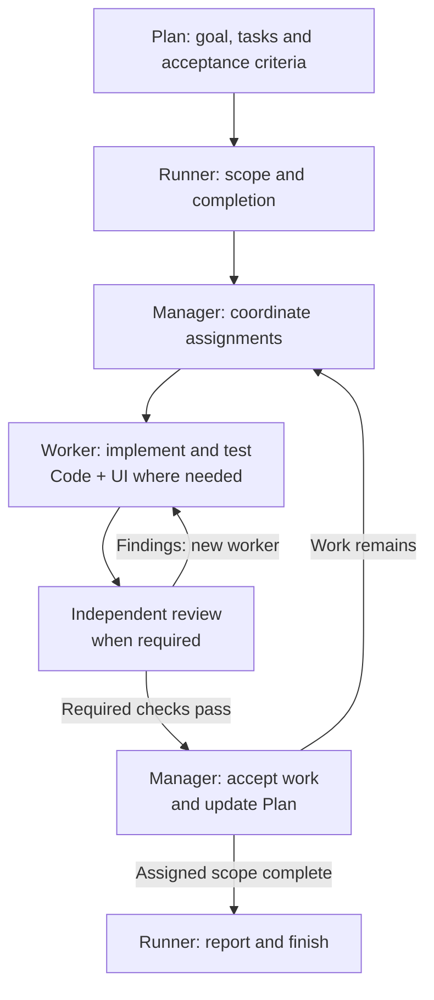

# Benjamin Stelzer

I build Agent Skills that help coding agents make reliable, verifiable changes.
The Scoville Suite is built around Scoville Code's engineering rules, with
Skills for interfaces, planning, review and coordination.

## Why I build these Skills

I'm part of the team at [dynamitec](https://www.dynamitec.de/) and develop
these Skills from my own work with AI agents on real projects.

I keep encountering the same problems: agents adding structure before
understanding the existing code, losing earlier decisions or reporting
results they have not checked.

Scoville Code addresses the engineering side of this. A change needs to solve
the actual problem, fit the codebase and come with evidence of what works
and what remains unchecked.

The other Skills grew from the work around those changes. With Scoville
Workflow, I can now have agents carry out planned tasks over several days
with very little intervention from me. The implementation and review loop
helps catch mistakes before later work builds on them, reducing the risk
of autonomous changes drifting away from the plan.

## How it fits together

For example, take a feature that touches both backend and interface. Plan records
the goal, decisions, tasks and acceptance criteria. When I ask Workflow to run it in
Codex, a runner delegates coordination to manager agents, which assign bounded
pieces to workers. Workers implement
and test the changes using Code's engineering rules. UI adds the interface
decisions and checks of the rendered result.

Separate reviewers inspect the work. Findings lead to corrections, accepted
progress goes back into the Plan, and successor managers receive the unfinished
assignment and open issues. Work can continue without reconstructing the
project from a long conversation.

A small fix may need only Code, or Code and UI. Longer tasks add planning
and coordination while retaining the same engineering foundation.

## Scoville Suite

Choose [Scoville Suite for Codex](https://github.com/benjaminstelzer/scoville-suite-for-codex)
for Codex, or [Scoville Suite](https://github.com/benjaminstelzer/scoville-suite)
for Claude Code and other Agent Skills hosts. Both include Code, Plan, UI,
Handoff and Project Context Cleanup. The Codex edition adds Workflow, Ask and Setup. Workflow is Codex-only
for now because Codex is my daily driver. A Claude Code version is planned.

- [Workflow for Codex](https://github.com/benjaminstelzer/scoville-suite-for-codex/tree/main/members/scoville-workflow-for-codex)
  coordinates a repository Plan across manager agents, workers and reviewers.
- [Code](https://github.com/benjaminstelzer/scoville-code)
  provides engineering guidance for implementation, diagnosis and review,
  with checks proportionate to the consequences of a mistake.
- [Plan](https://github.com/benjaminstelzer/scoville-plan)
  keeps goals, tasks, decisions and progress available across sessions.
- [UI](https://github.com/benjaminstelzer/scoville-ui)
  covers interface structure, wording, interaction and rendered checks,
  including plugin-owned WordPress admin pages.
- [Handoff](https://github.com/benjaminstelzer/scoville-handoff)
  turns unfinished work into a continuation prompt for transfers outside Workflow.
- [Ask for Codex](https://github.com/benjaminstelzer/scoville-ask-for-codex)
  gets independent read-only advice from configured Codex or Claude advisers.
- [Setup](https://github.com/benjaminstelzer/scoville-suite-for-codex/tree/main/members/scoville-setup)
  manages the project's model and Workflow settings.

- [Project Context Cleanup](https://github.com/benjaminstelzer/scoville-suite/tree/main/members/scoville-project-context-cleanup)
  handles requested edits to project rules and index text while preserving meaning,
  scope and record ownership.

Code, Plan, UI, Handoff and Ask are also available on their own.
Workflow, Setup and Project Context Cleanup come through their suites.

## How I work

A new Skill starts with a recurring problem in my own projects. I first check
whether it belongs in an existing Skill. A separate Skill needs a clear
responsibility. Targeted tests cover the boundaries: when it should apply,
when it should stay out and when several Skills need to contribute. The
results help sharpen both the descriptions and the division of work.

Improving existing Skills involves extensive test runs and analyses of complete
project conversations. Over months, I have traced patterns through
implementation, review and correction that an isolated answer would miss:
a plausible result hiding a missed requirement, or a safeguard growing into
layers of checks that cost more than the problem warrants.

Those findings become test cases and corrections to the instructions. I
evaluate the next runs against earlier results, checking the original failure
and effects elsewhere. Repeated searches, unnecessary checks and oversized
output matter because they consume time and context needed for the task.

I deliberately test with smaller models than the ones I use day to day.
The instructions need to work without a stronger model filling in missing
context or resolving ambiguities. Failures in those runs show where the
wording, scope or sequence still needs work.
